# Create a Custom Step
* [Exercise Description](#exercise-description)
* [Create a Custom Step](#create-a-custom-step-1)
  * [*Assignment*: Complete Page 1 UI](#assignment-complete-page-1-ui)
  * [Set Port Details](#set-port-details)
  * [*Assignment*: Build Page 2 UI](#assignment-build-page-2-ui)
  * [*Assignment*: Build Page 3 UI](#assignment-build-page-3-ui)
  * [Add Code to the Custom Step](#add-code-to-the-custom-step)
* [Open and Test the Custom Step in Stand-Alone Mode](#open-and-test-the-custom-step-in-stand-alone-mode)
  * [Assignment: Test the Custom Step](#assignment-test-the-custom-step)
* [Use the Custom Step in a SAS Studio Flow](#use-the-custom-step-in-a-sas-studio-flow)

<br>

## Exercise Description
In this exercise you create a custom step that calculates the geo-distance between two latitude and longitude locations in either kilometers or miles and provide the option to round the result.  After the custom step is built you test it in stand-alone mode and then use it in a SAS Studio Flow.

<br>
<br>

## Create a Custom Step
1. Log on to SAS Viya with the following credentials:
   - User: **Alex**
   - Password: **lnxsas**

1. Select  **&#10132; Develop Code and Flows** to open *SAS Studio*.
1. Select  to view the **Steps** pane.
1. Select 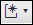 &#10132; **Custom step quick start** to create a new custom step.
1. On the **Properties** for the *Page* on the *Designer* tab, enter the following:
   - ID: **GeoDist**
   - Label: **Calculate Geo Distance**

     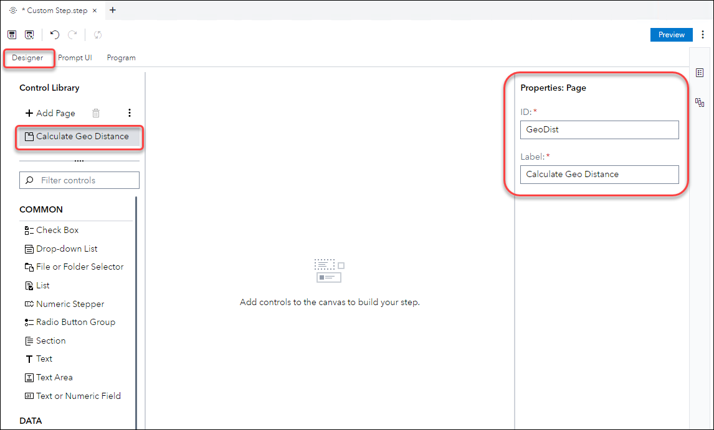

1. Drag the **Input Table** *DATA* control onto the canvas.
1. Enter the **Properties** for the *Input Table*, enter the following:
   - ID: **inTable**
   - Label: **Input table**
   - 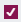 Required

    > &#8252; The **ID** names for the controls are used in the code for the custom step, so ensure you enter them correctly; otherwise, you will either need to edit the code or the control ID.

1. Select  to save the custom step.
1. Navigate to **Folder Shortcuts &#10132; Shortcut to My Folder &#10132; Workshop**.
1. Enter **GeoDist with Rounding** for the *name* and click **Save**.

   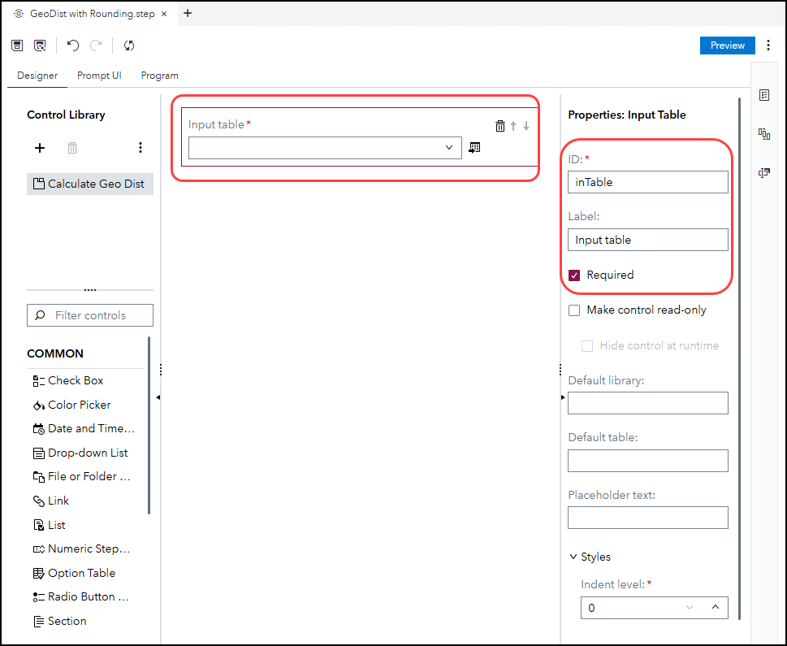

<br>

### *Assignment*: Complete Page 1 UI
Add a **Radio Button Group** *COMMON* control to the canvas.  Enter the properties as depicted below.

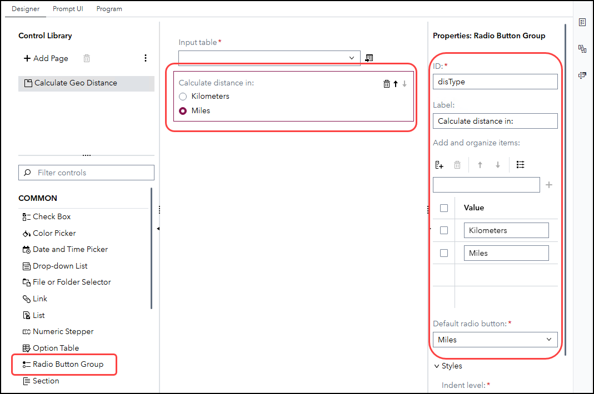

<br>

Add a **Section** *COMMON* control to the canvas.  Enter the properties as depicted below.

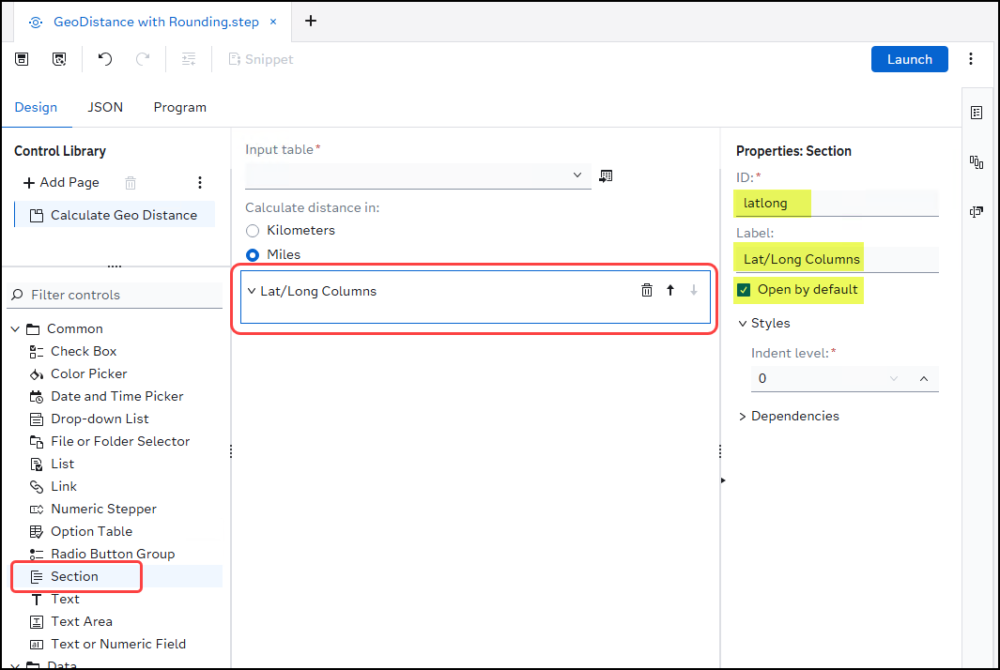

<br>

Add a **Column Selector** *DATA* control to the canvas in the *Lat/Long Columns* section group.  Enter the properties as depicted below.

   > &#9755; Right-click the control once added to the canvas and select **Move to section &#10132; Lat/Long Columns** to place it in the section.

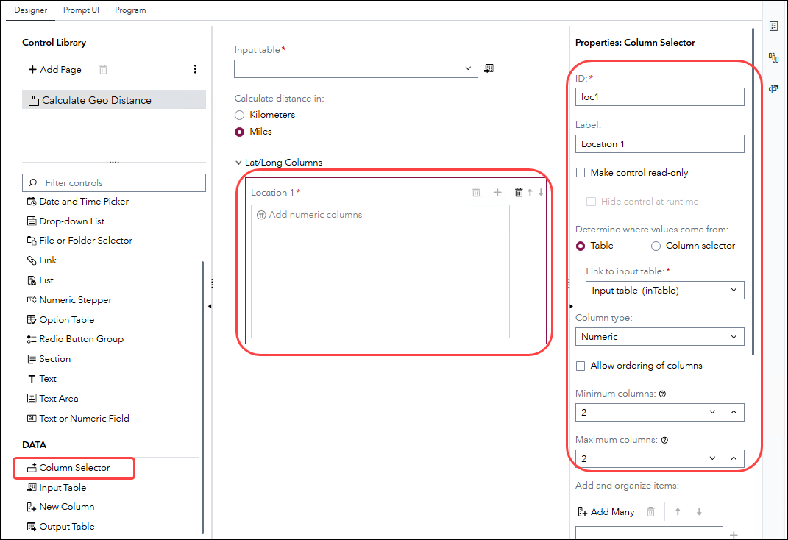

<br>

**Duplicate** the *Location1 Column Selector* control and paste it below in the *Lat/Long Columns* section group.  Edit the properties as depicted below.

   > &#9755; Right-click the *Location 1* control once added to the canvas and select **Duplicate**.

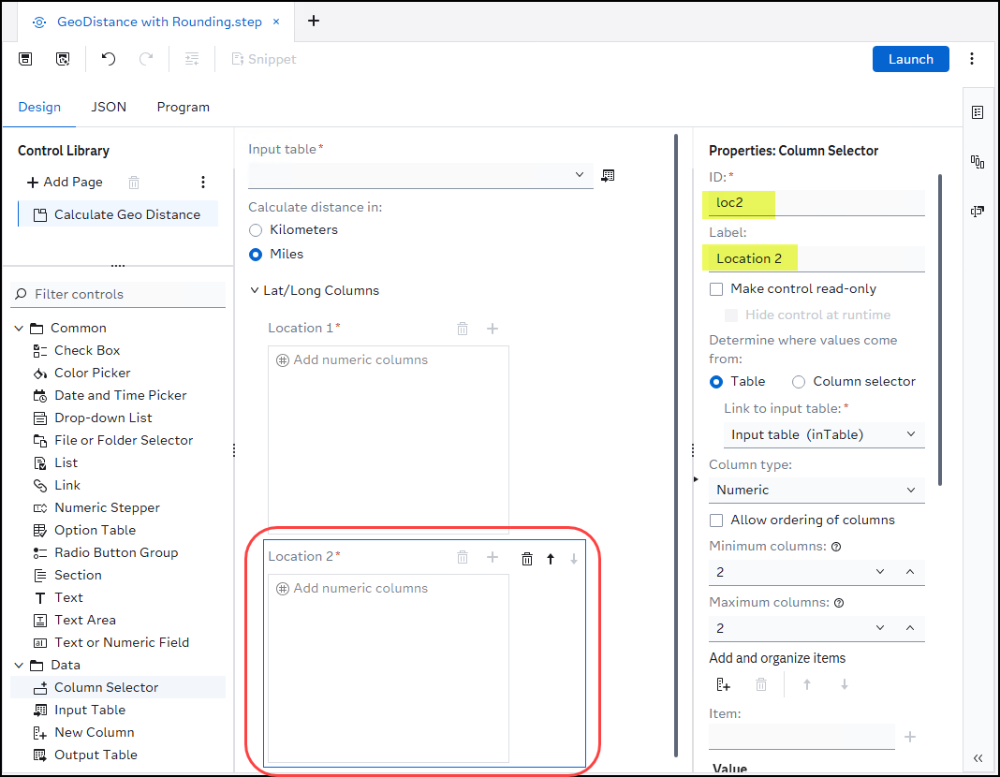

<br>

Add a **New Column** *DATA* control to the main canvas.  Enter the properties as depicted below.

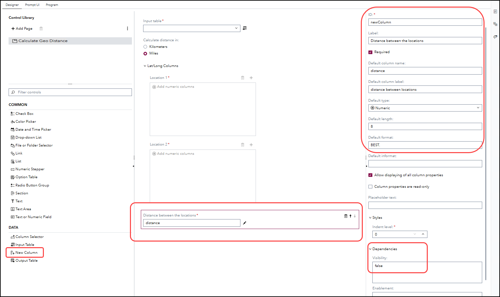

  > &#9998; Setting visibility to *false* means that the user will not be able to view this control.  The column name will be controlled by the code, but is needed for the output options in the port details you will set later in this exercise.

<br>

Add an **Output Table** *DATA* control to the main canvas.  Enter the properties as depicted below.

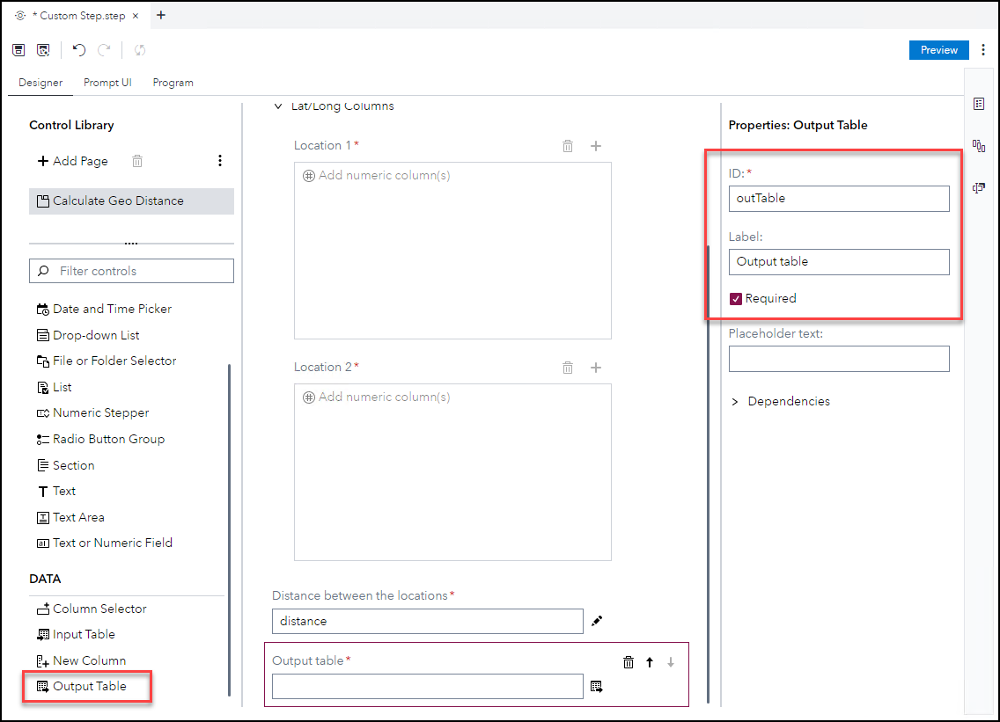

<br>

**Save** the Custom Step.  Select **Preview** to preview the design of Page 1 - *Calculate Geo Distance*.

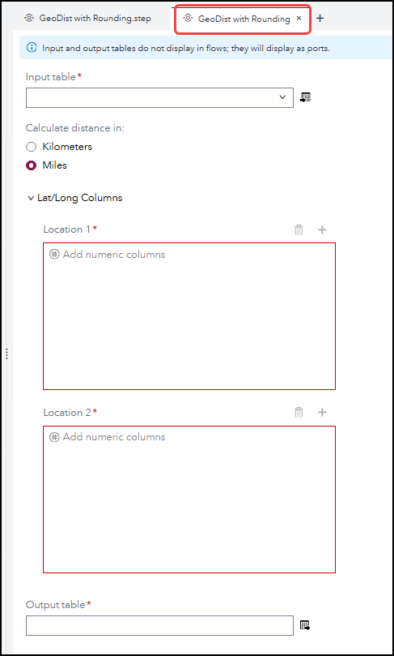

> &#9998; The *new column* is not displayed in the Preview since its visibility is set to *false*.

**Close** the preview when done.

<br>
<br>

### Set Port Details
1. Select 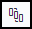 to enter the port details for the custom step.

    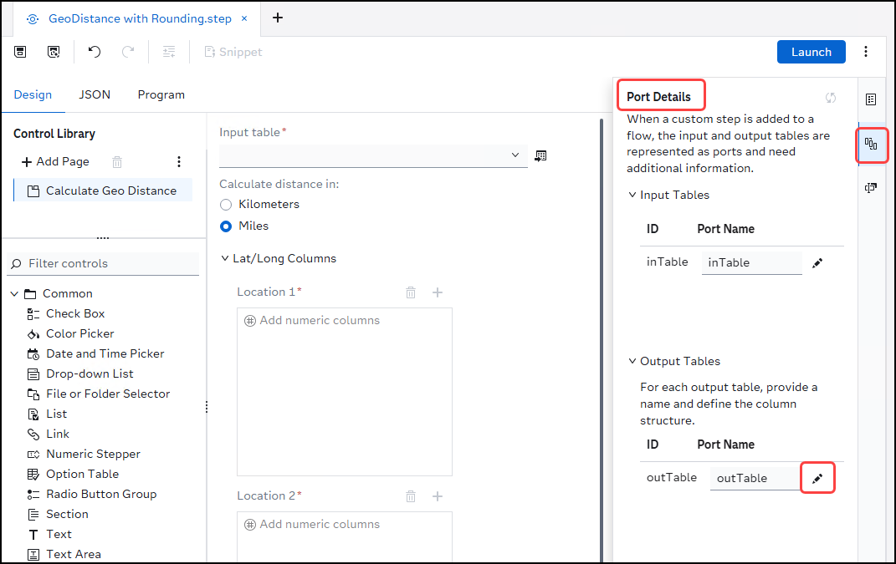

1. Select  for the **outTable** *Output Tables* port to edit its details.
1. Select **All columns &#10132; Input table (inTable)** to add all the columns from that input table to the output.

    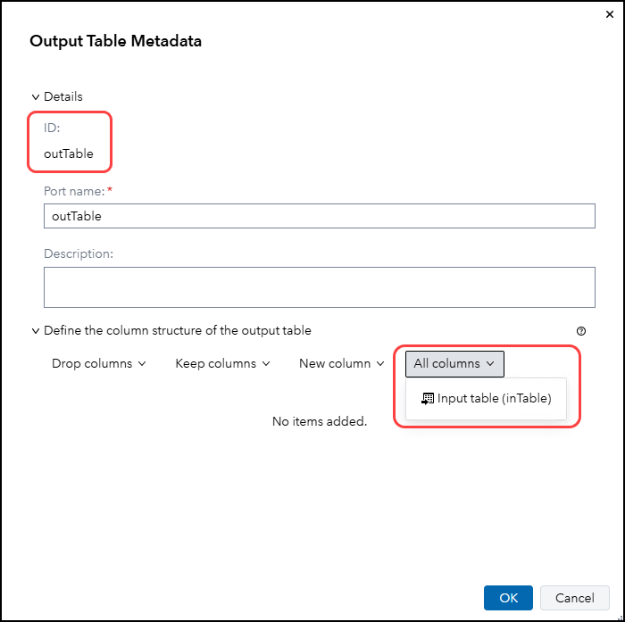

1. Select **New column &#10132; Distance between the locations (newColumn)** to add that new column to the output.

    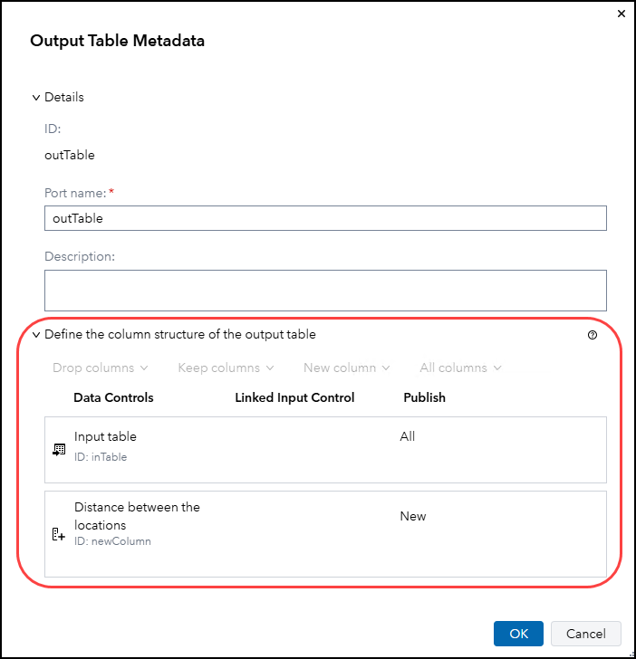

1. Select **OK** to save the changes to output table metadata.
1. **Save** the changes to the custom step.

<br>
<br>

### *Assignment*: Build Page 2 UI
Create a second page for the custom step by selecting 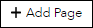 in the *Control Library* on the *Designer* tab. Enter the properties as depicted below.

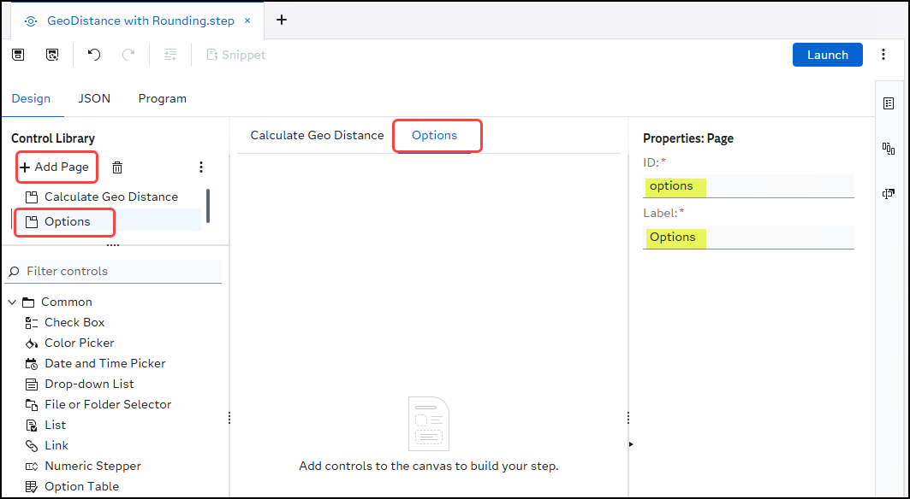

<br>

Add a **Check Box** *COMMON* control to the canvas on *Page2*.  Enter the properties as depicted below.

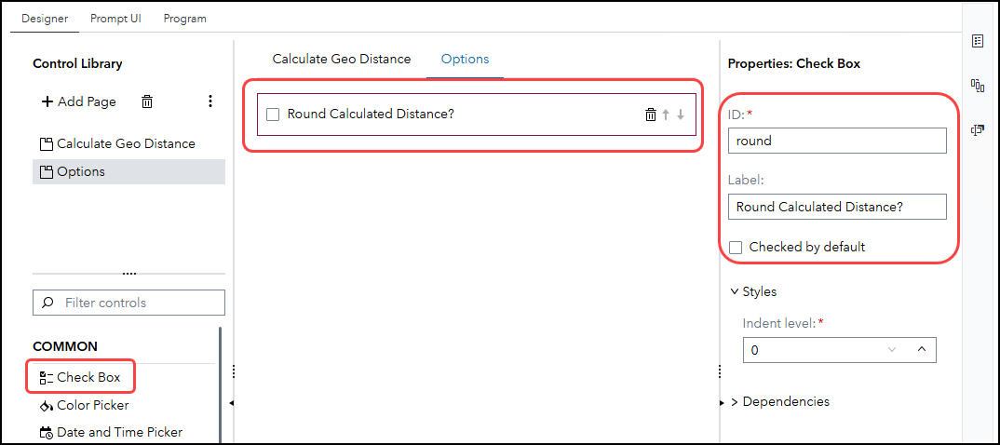

<br>

Add a **Text or Numeric Field** *COMMON* control to the canvas.  Enter the properties as depicted below.

  > &#9998; **"$round"** in the *Dependencies visiblity* section indicates that this control is dependent on the **round** *Check Box* control and will only be displayed if it is checked.

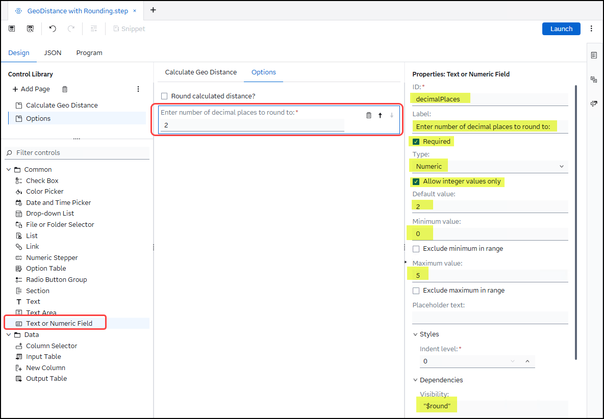

<br>

**Save** and **Preview** Page 2 - *Options* of the custom step.  Confirm that the dependent **decimalPlaces** selection is only displayed if the **round** check box is checked.

**Round Option Unchecked**

  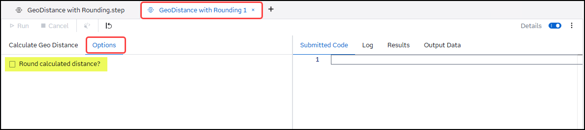


**Round Option Checked**

  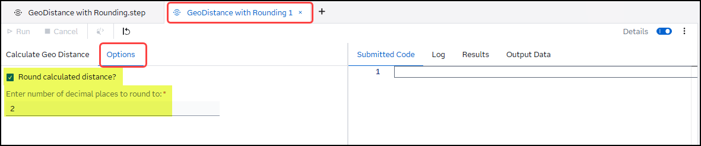

**Close** the preview when done.

<br>
<br>

### *Assignment*: Build Page 3 UI
Add an **About** page (tab).  On the *About* tab, use the **Text** control in the *COMMON* section to add the following text:
**This custom step was built for a workshop.  It calculates the distance between two locations.**

**Save** the custom step.

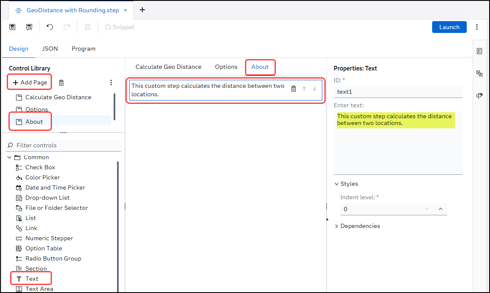

<br>
<br>

### Add Code to the Custom Step
1. Select the **Program** tab on the custom step.
1. Copy and Paste the following code:

```sas
/* Set Input and Output Data */
data &outTable ;
	set &inTable ;


/* newColumn is a hidden control in the UI.  The code sets the name of the new output column. */

/* Calculate GeoDistance in Miles */
%if &disType=Miles %then %do ;
	%let newColumn_name=distance_in_Miles ;
	&newColumn_name=geodist(&loc1_1_name, &loc1_2_name, &loc2_1_name, &loc2_2_name, 'M') ;
%end;

/* Calculate GeoDistance in Kilometers */
%else %do ;
	%let newColumn_name=distance_in_Kilometers ;
	&newColumn_name=geodist(&loc1_1_name, &loc1_2_name, &loc2_1_name, &loc2_2_name, 'K') ;
%end ;


/* Round GeoDistance Value */
%if &round=1 %then %do ;
	select(&decimalPlaces) ;
		when(0)  &newColumn_name=round(distance_in_&disType) ;
    	when(1)  &newColumn_name=round(distance_in_&disType,0.1) ;
		when(2)  &newColumn_name=round(distance_in_&disType,0.01) ;
		when(3)  &newColumn_name=round(distance_in_&disType,0.001) ;
		when(4)  &newColumn_name=round(distance_in_&disType,0.0001) ;
		when(5)  &newColumn_name=round(distance_in_&disType,0.00001) ;
    end;
%end;
run;
```


  > &#8252; The **ID** names for the controls are used in the code for the custom step, so ensure you entered them correctly; otherwise, you will either need to edit the code or the control ID in the *Designer*.

3. **Save** and close the custom step.


<br>
<br>

## Open and Test the Custom Step in Stand-Alone Mode
1. Select 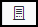 to view the **Explorer** tab in *SAS Studio*.

1. Navigate to **Folder Shortcuts &#10132; Shortcut to My Folder &#10132; Workshop**.
1. Select **Geo Dist with Rounding.step** and right-click to view its menu.
1. Select **Open in a tab** to view the custom step in stand-alone mode.

### Assignment: Test the Custom Step
Perform various tests using **MAPS.AFRICA** as the input table.  Select columns **X** and **Y** as *Location 1* and columns **LAT** and **LONG** as *Location 2*.  Select **WORK.TEST** as the output table.  View the resulting table in the **WORK** library.Play around with different options.

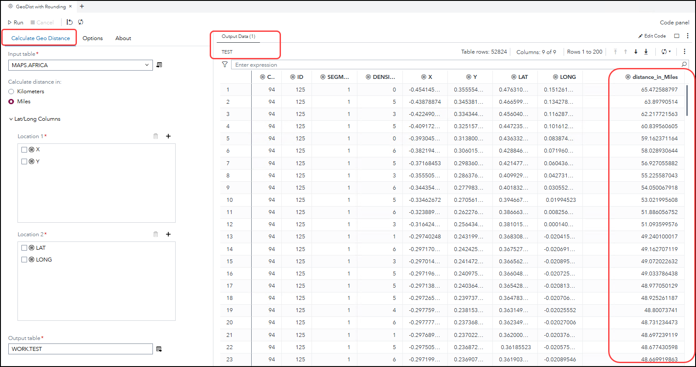

<br>
<br>

## Use the Custom Step in a SAS Studio Flow

Create the flow pictured below in SAS Studio to use the custom step you created to calculate the distance between two locations.  The input file **Location_Data.xls** is located at: **Folder Shortcuts &#10132; Shortcut to My Folder &#10132; Workshop** &#10132; **data**. Select the latitude and longitude fields as depicted in the screenshot. Calculate the distance in **Miles** and **round to 2 decimal places**.

  > &#9755; The custom step is available for selection on the **Shared** tab of the *Steps* pane.

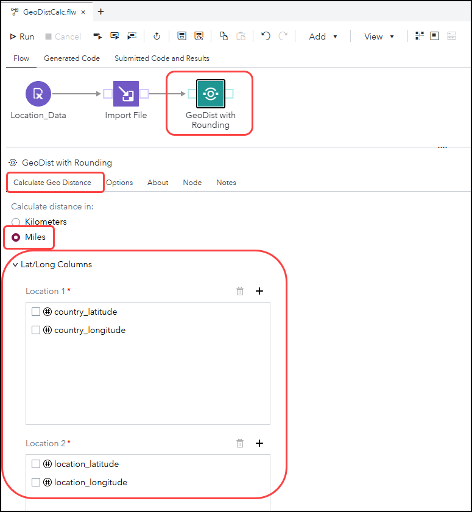

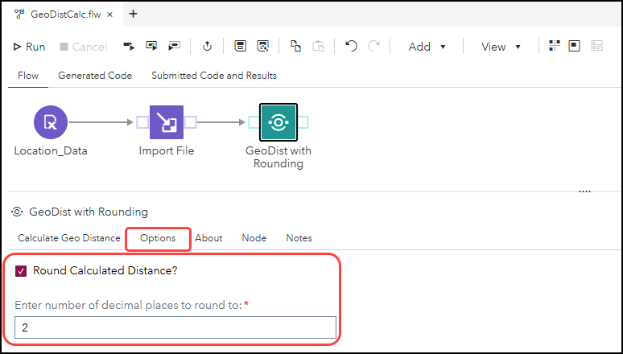

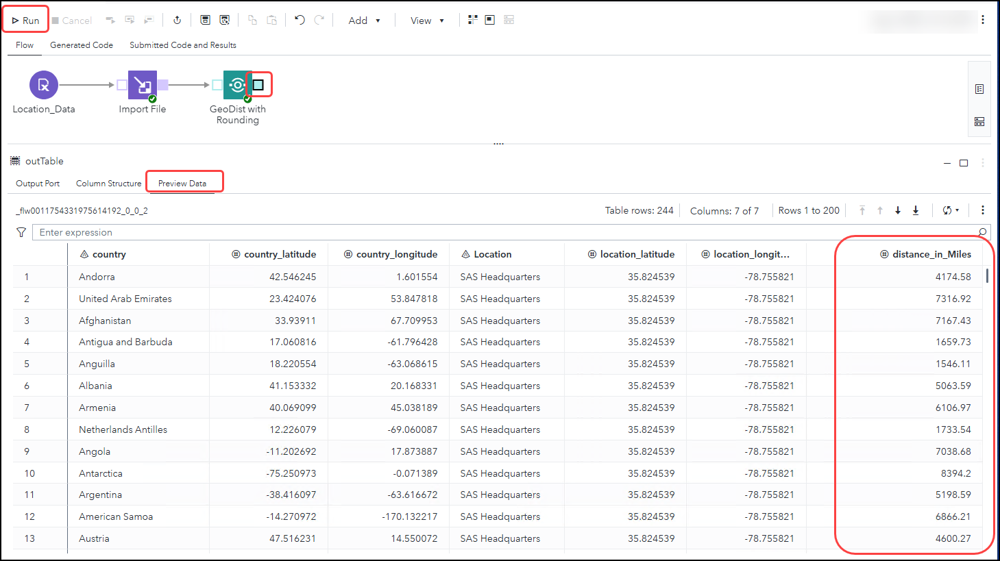

